# Diagramas UML - Catalog Aljaba

## Índice de Diagramas

1. [Diagrama de Casos de Uso](#1-diagrama-de-casos-de-uso)
2. [Diagrama de Clases](#2-diagrama-de-clases)
3. [Diagrama de Secuencia - Importar CSV](#3-diagrama-de-secuencia-importar-csv)
4. [Diagrama de Secuencia - Generar Catálogo PDF](#4-diagrama-de-secuencia-generar-catálogo-pdf)
5. [Diagrama de Secuencia - Acceso Guest](#5-diagrama-de-secuencia-acceso-guest)
6. [Diagrama de Componentes](#6-diagrama-de-componentes)
7. [Diagrama de Despliegue](#7-diagrama-de-despliegue)
8. [Diagrama de Actividades - Flujo Completo](#8-diagrama-de-actividades-flujo-completo)
9. [Diagrama Entidad-Relación (Base de Datos)](#9-diagrama-entidad-relación)

---

## 1. Diagrama de Casos de Uso

### Descripcion
Muestra las interacciones principales entre los actores (Admin y Empleado Rutero/Guest) y el sistema.

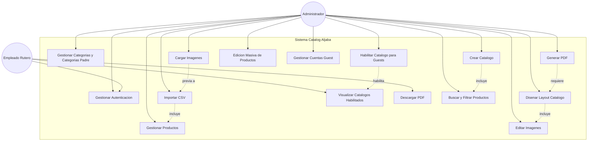

### Casos de Uso Principales

| ID | Caso de Uso | Actor | Descripcion |
|----|-------------|-------|-------------|
| UC1 | Gestionar Autenticacion | Admin, Guest | Login y logout con usuario y contrasena |
| UC2 | Importar CSV | Admin | Carga masiva de productos desde archivo CSV (11 columnas) |
| UC3 | Gestionar Productos | Admin | CRUD completo de productos |
| UC4 | Gestionar Categorias y Categorias Padre | Admin | Crear categorias, subcategorias y categorias padre que agrupan categorias |
| UC5 | Cargar Imagenes | Admin | Subir imagenes al sistema con nombre igual al code del producto |
| UC6 | Editar Imagenes | Admin | Edicion avanzada con capas y efectos |
| UC7 | Crear Catalogo | Admin | Iniciar nuevo catalogo |
| UC8 | Disenar Layout Catalogo | Admin | Personalizar apariencia del catalogo |
| UC9 | Generar PDF | Admin | Exportar catalogo a PDF |
| UC10 | Habilitar Catalogo para Guests | Admin | Activar o desactivar visibilidad de un catalogo para todos los Guests |
| UC11 | Visualizar Catalogos Habilitados | Guest | Ver los catalogos que el Admin ha habilitado |
| UC12 | Descargar PDF | Guest | Descargar el PDF de un catalogo habilitado |
| UC13 | Buscar y Filtrar Productos | Admin | Busqueda avanzada y filtros multiples |
| UC14 | Edicion Masiva de Productos | Admin | Modificar multiples productos simultaneamente |
| UC15 | Gestionar Cuentas Guest | Admin | Crear, editar y desactivar cuentas de empleados ruteros |

---

## 2. Diagrama de Clases

### Descripcion
Estructura de las clases principales del sistema y sus relaciones.

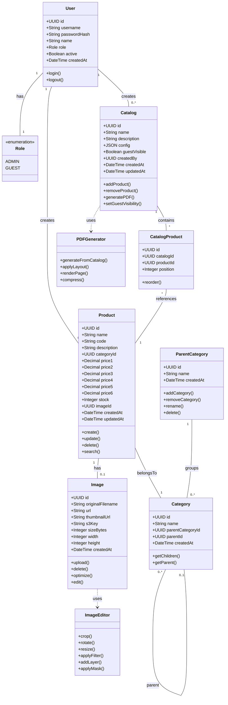

### Explicacion de Relaciones

- **User - Product/Catalog:** Un usuario Admin crea productos y catalogos.
- **Product - Category:** Cada producto pertenece a una categoria.
- **Product - Image:** Cada producto puede tener una imagen asociada. La vinculacion se hace por nombre de archivo.
- **ParentCategory - Category:** Una categoria padre agrupa multiples categorias. La relacion es de total disposicion del Admin.
- **Category - Category:** Relacion auto-referencial para subcategorias.
- **Catalog - Product (a traves de CatalogProduct):** Relacion muchos-a-muchos.
- **Catalog.guestVisible:** Campo booleano que controla si el catalogo es visible para todos los Guests autenticados. No hay enlaces individuales ni expiracion.

---

## 3. Diagrama de Secuencia: Importar CSV

### Descripcion
Flujo de importacion de productos desde archivo CSV, incluyendo la vinculacion automatica de imagenes por nombre.

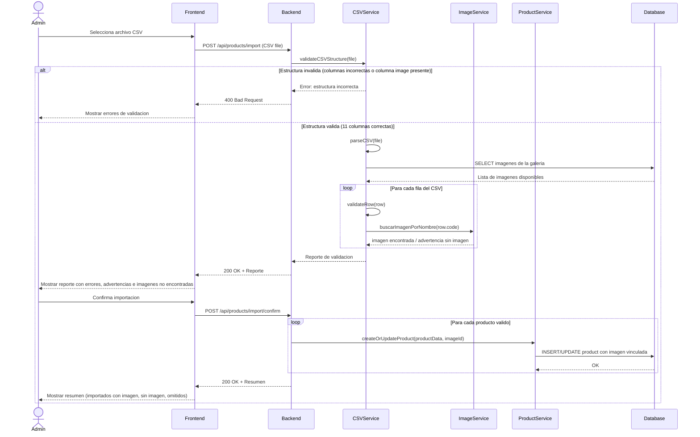

### Flujo Alternativo: Producto Duplicado

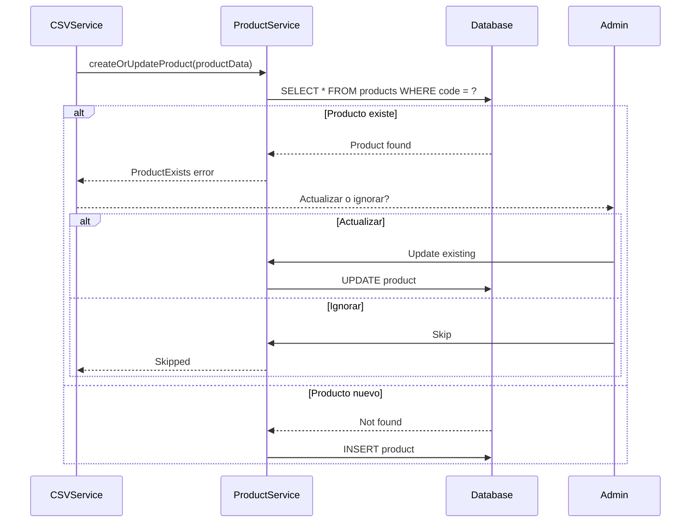

---

## 4. Diagrama de Secuencia: Generar Catálogo PDF

### Descripción
Proceso de generación de PDF desde catálogo diseñado.

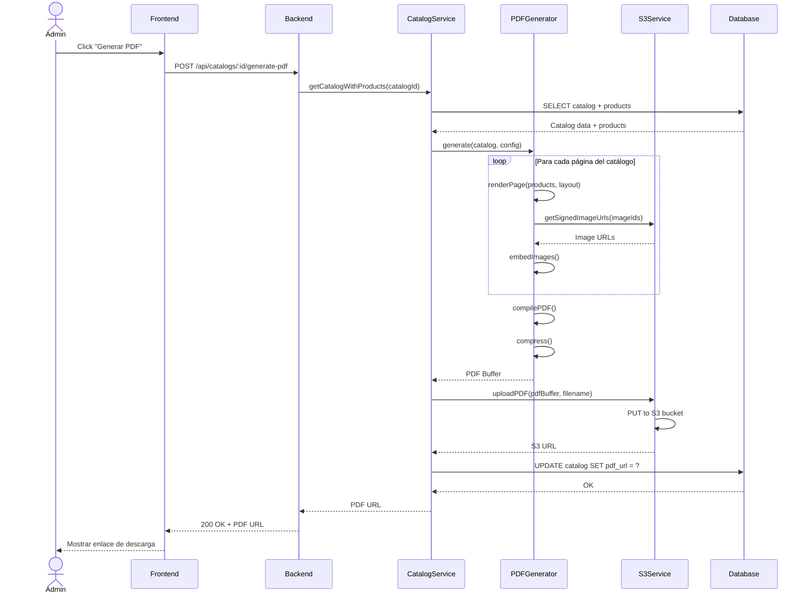

### Manejo de Error

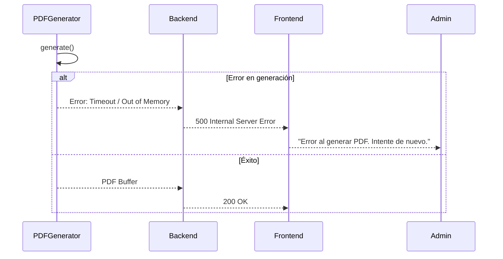

---

## 5. Diagrama de Secuencia: Acceso Guest (Empleado Rutero)

### Descripcion
Flujo de acceso de un empleado rutero (Guest) al sistema para ver y descargar catalogos habilitados.

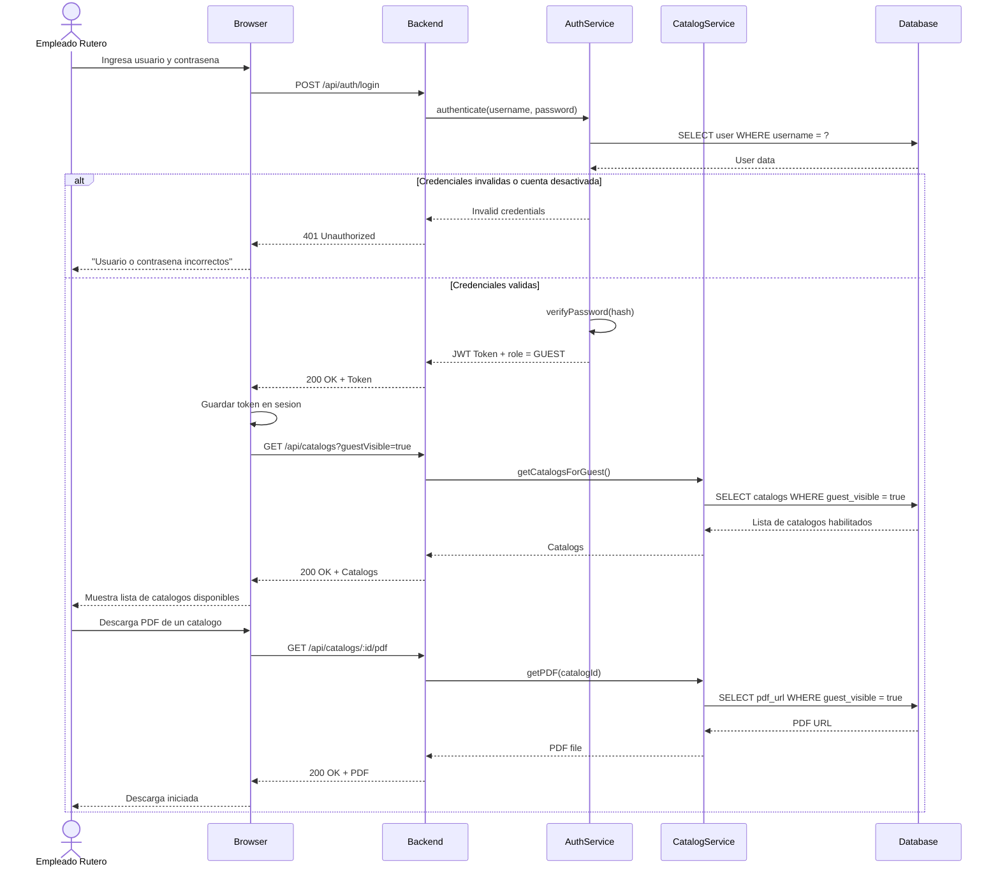

---

## 6. Diagrama de Componentes

### Descripción
Arquitectura de componentes del sistema, mostrando módulos principales y sus dependencias.

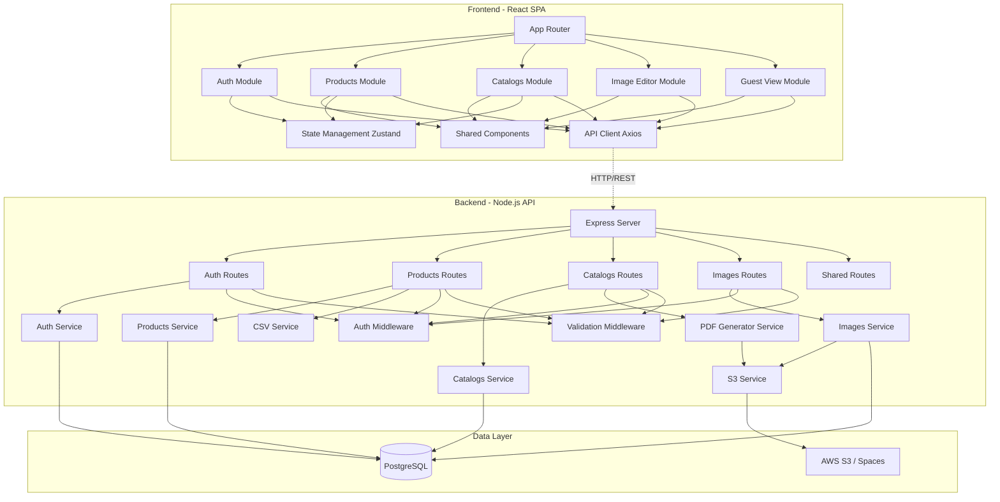

### Explicación de Componentes

#### Frontend
- **App Router:** Enrutamiento de la SPA (React Router)
- **Auth Module:** Login, registro, recuperación de contraseña
- **Products Module:** CRUD de productos, búsqueda, filtros, edición masiva
- **Catalogs Module:** Creación y diseño de catálogos
- **Image Editor Module:** Editor visual de imágenes
- **Guest View Module:** Vista simplificada para usuarios invitados
- **Shared Components:** Botones, inputs, cards, modales reutilizables
- **State Management:** Zustand para estado global de la app
- **API Client:** Axios configurado con interceptores y manejo de errores

#### Backend
- **Express Server:** Servidor HTTP principal
- **Routes:** Definición de endpoints REST
- **Services:** Lógica de negocio y comunicación con base de datos
- **Middlewares:** Autenticación JWT, validación de inputs, rate limiting

#### Data Layer
- **PostgreSQL:** Base de datos relacional para datos estructurados
- **S3/Spaces:** Almacenamiento de imágenes y PDFs generados

---

## 7. Diagrama de Despliegue

### Descripción
Infraestructura física y lógica donde se desplegará el sistema.

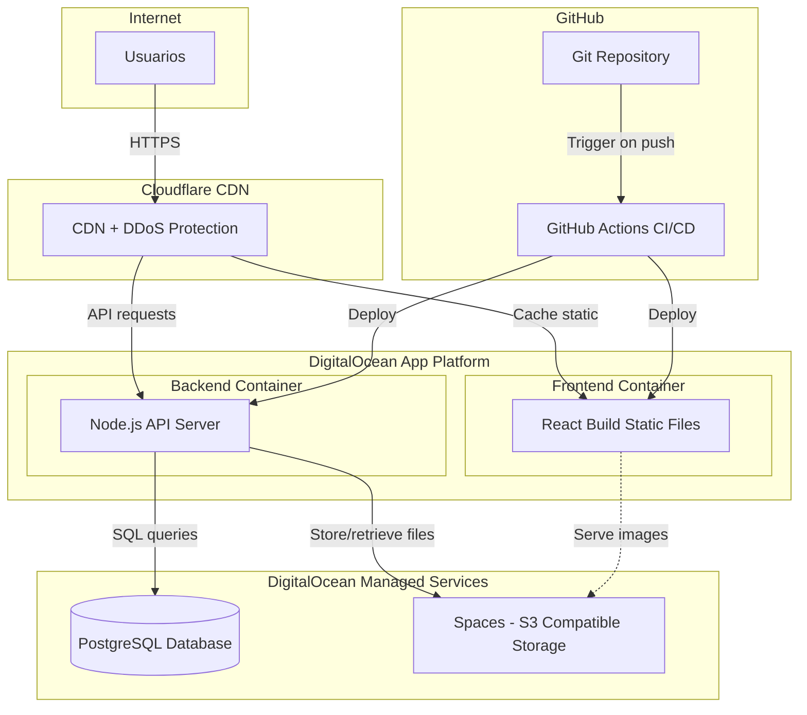

### Especificaciones Técnicas

#### Frontend (Static Hosting)
- **Plataforma:** DigitalOcean App Platform (Static Site)
- **Recursos:** CDN global incluido
- **Costo:** Gratis (incluido en plan)

#### Backend (Containerized App)
- **Plataforma:** DigitalOcean App Platform (Web Service)
- **Recursos:** 1GB RAM, 1 vCPU
- **Runtime:** Node.js 20 LTS
- **Costo:** $12/mes

#### Base de Datos
- **Servicio:** DigitalOcean Managed PostgreSQL
- **Recursos:** 1GB RAM, 10GB storage, 10 conexiones
- **Backups:** Automático diario incluido
- **Costo:** $15/mes

#### Almacenamiento
- **Servicio:** DigitalOcean Spaces (S3-compatible)
- **Recursos:** 50GB storage + CDN
- **Transferencia:** 1TB bandwidth incluido
- **Costo:** $5/mes

#### CI/CD
- **Plataforma:** GitHub Actions
- **Trigger:** Push a rama `main`
- **Acciones:** Lint → Test → Build → Deploy
- **Costo:** Gratis (plan estándar)

---

## 8. Diagrama de Actividades: Flujo Completo

### Descripcion
Flujo end-to-end actualizado, desde carga de imagenes hasta descarga por el empleado rutero.

```mermaid
flowchart TD
    Start([Inicio]) --> A[Admin inicia sesion]
    A --> B{Productos existen?}

    B -->|No| C0[Subir imagenes al sistema]
    B -->|Si| D[Gestionar productos]

    C0 --> C0a[Nombrar cada imagen igual al code del producto]
    C0a --> C[Importar CSV]
    C --> C1[Subir archivo CSV de 11 columnas]
    C1 --> C2[Validar estructura]
    C2 --> C3{Valido?}

    C3 -->|No| C4[Mostrar errores]
    C4 --> C1
    C3 -->|Si| C5[Importar productos]
    C5 --> C6[Sistema vincula automaticamente imagenes por nombre]
    C6 --> D

    D --> D1[Buscar y filtrar productos]
    D1 --> D2{Editar imagenes?}

    D2 -->|Si| E[Abrir editor de imagenes]
    D2 -->|No| F
    E --> E1[Aplicar efectos y capas]
    E1 --> E2[Guardar imagen editada conservando nombre]
    E2 --> F[Crear nuevo catalogo]

    F --> F1[Seleccionar productos]
    F1 --> F2[Elegir layout]
    F2 --> F3[Personalizar diseno]
    F3 --> F4[Vista previa]
    F4 --> F5{Diseno OK?}

    F5 -->|No| F3
    F5 -->|Si| G[Generar PDF]

    G --> G1[Renderizar paginas]
    G1 --> G2[Compilar PDF]
    G2 --> G3[Almacenar en S3]
    G3 --> H[Habilitar catalogo para Guests]

    H --> H1[Admin activa toggle de visibilidad Guest]
    H1 --> I[Empleados ruteros ven el catalogo]

    I --> J[Guest inicia sesion con usuario y contrasena]
    J --> J1{Credenciales validas?}

    J1 -->|No| J2[Mostrar error de login]
    J1 -->|Si| K[Visualizar lista de catalogos habilitados]

    K --> L[Descargar PDF del catalogo]
    L --> M[Mostrar catalogo al cliente]

    M --> End([Fin])
    J2 --> End
```

---

## 9. Diagrama Entidad-Relacion (Base de Datos)

### Descripcion
Modelo de datos actualizado de la base de datos PostgreSQL.

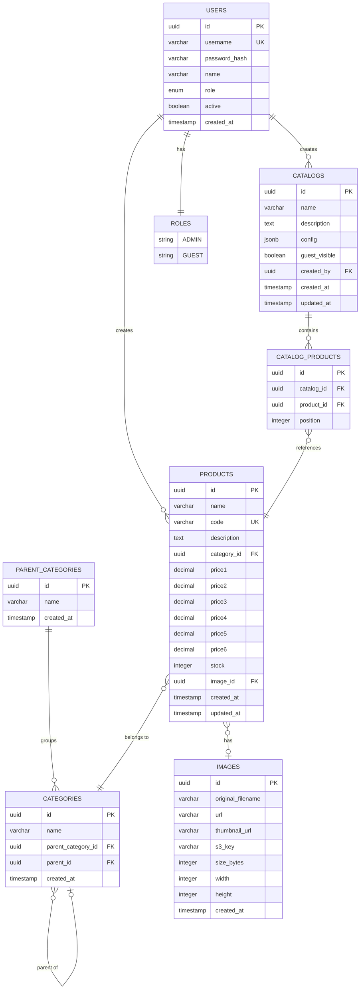

### Cambios respecto a la version anterior

| Tabla | Cambio |
|-------|--------|
| `USERS` | `email` reemplazado por `username`; agregado campo `active` para desactivar cuentas Guest |
| `PARENT_CATEGORIES` | Tabla nueva para categorias padre que agrupan categorias |
| `CATEGORIES` | Agregado campo `parent_category_id` FK hacia `PARENT_CATEGORIES` |
| `IMAGES` | `filename` renombrado a `original_filename`; eliminado `original_url` (ya no se importan desde URL externa) |
| `CATALOGS` | Agregado campo `guest_visible` booleano; eliminada relacion con `SHARED_LINKS` |
| `SHARED_LINKS` | Tabla eliminada; la visibilidad Guest se controla con `catalogs.guest_visible` |

### Indices Recomendados

```sql
CREATE INDEX idx_products_code ON products(code);
CREATE INDEX idx_products_name ON products(name);
CREATE INDEX idx_products_category ON products(category_id);
CREATE INDEX idx_products_created_at ON products(created_at DESC);

CREATE INDEX idx_categories_parent ON categories(parent_id);
CREATE INDEX idx_categories_parent_category ON categories(parent_category_id);

CREATE INDEX idx_catalogs_guest_visible ON catalogs(guest_visible);
CREATE INDEX idx_catalogs_created_by ON catalogs(created_by);
CREATE INDEX idx_catalog_products_catalog ON catalog_products(catalog_id);

CREATE INDEX idx_images_original_filename ON images(original_filename);

CREATE INDEX idx_users_username ON users(username);

CREATE INDEX idx_products_search ON products
    USING GIN(to_tsvector('spanish', name || ' ' || description));
```

---

## 10. Diagrama de Estados: Catalogo

### Descripcion
Ciclo de vida de un catalogo desde creacion hasta habilitacion para empleados ruteros.

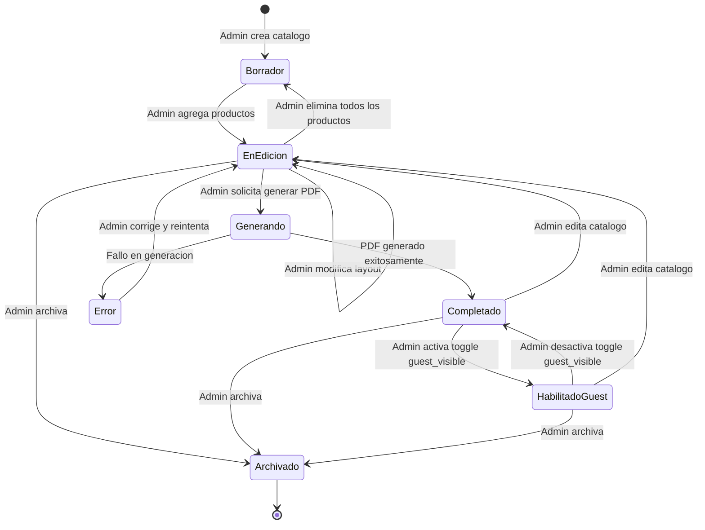

### Estados

| Estado | Descripcion |
|--------|-------------|
| Borrador | Catalogo sin productos asignados |
| EnEdicion | Tiene productos pero sin PDF generado, o fue re-editado |
| Completado | PDF generado y almacenado, visible solo para Admin |
| HabilitadoGuest | Visible y descargable para todos los empleados ruteros autenticados |
| Archivado | Desactivado, no visible para nadie |

---

## 11. Diagrama de Paquetes: Estructura del Backend

### Descripción
Organización de módulos y paquetes del backend.

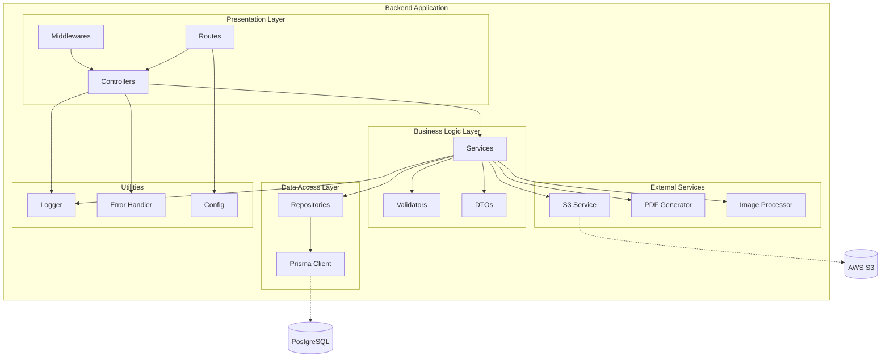

---

## Resumen de Diagramas

|  #  |     Diagrama     |           Propósito              |           Audiencia          |
|-----|------------------|----------------------------------|------------------------------|
|  1  | Casos de Uso     | Funcionalidades del sistema      | Stakeholders, Product Owner  |
|  2  | Clases           | Estructura de datos y relaciones | Desarrolladores              |
| 3-5 | Secuencia        | Flujos de interacción detallados | Desarrolladores, Testers     |
|  6  | Componentes      | Arquitectura de software         | Arquitecto, Desarrolladores  |
|  7  | Despliegue       | Infraestructura física           | DevOps, Infraestructura      |
|  8  | Actividades      | Flujo end-to-end                 | Todos                        |
|  9  | Entidad-Relación | Modelo de base de datos          | DBA, Desarrolladores Backend |
|  10 | Estados          | Ciclo de vida de entidades       | Desarrolladores, QA          |
|  11 | Paquetes         | Organización de código           | Desarrolladores              |

---

**Ultima actualizacion:** 20 de febrero de 2026
**Version:** 2.0
