# Diagramas UML - Catalog Aljaba

## Índice de Diagramas

1. [Diagrama de Casos de Uso](#1-diagrama-de-casos-de-uso)
2. [Diagrama de Clases](#2-diagrama-de-clases)
3. [Diagrama de Secuencia - Importar CSV](#3-diagrama-de-secuencia-importar-csv)
4. [Diagrama de Secuencia - Generar Catálogo PDF](#4-diagrama-de-secuencia-generar-catálogo-pdf)
5. [Diagrama de Secuencia - Acceso Guest](#5-diagrama-de-secuencia-acceso-guest)
6. [Diagrama de Componentes](#6-diagrama-de-componentes)
7. [Diagrama de Despliegue](#7-diagrama-de-despliegue)
8. [Diagrama de Actividades - Flujo Completo](#8-diagrama-de-actividades-flujo-completo)
9. [Diagrama Entidad-Relación (Base de Datos)](#9-diagrama-entidad-relación)

---

## 1. Diagrama de Casos de Uso

### Descripción
Muestra las interacciones principales entre los actores (Admin y Guest) y el sistema.

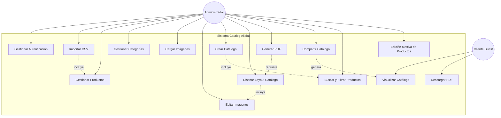

### Casos de Uso Principales

| ID | Caso de Uso | Actor | Descripción |
|----|-------------|-------|-------------|
| UC1 | Gestionar Autenticación | Admin | Login, logout, recuperación de contraseña |
| UC2 | Importar CSV | Admin | Carga masiva de productos desde archivo CSV |
| UC3 | Gestionar Productos | Admin | CRUD completo de productos |
| UC4 | Gestionar Categorías | Admin | Crear y organizar categorías |
| UC5 | Cargar Imágenes | Admin | Subir imágenes al sistema |
| UC6 | Editar Imágenes | Admin | Edición avanzada con capas y efectos |
| UC7 | Crear Catálogo | Admin | Iniciar nuevo catálogo |
| UC8 | Diseñar Layout Catálogo | Admin | Personalizar apariencia del catálogo |
| UC9 | Generar PDF | Admin | Exportar catálogo a PDF |
| UC10 | Compartir Catálogo | Admin | Generar enlace de acceso para guests |
| UC11 | Visualizar Catálogo | Guest | Ver catálogo compartido |
| UC12 | Descargar PDF | Guest | Descargar catálogo en PDF |
| UC13 | Buscar y Filtrar | Admin | Búsqueda avanzada de productos |
| UC14 | Edición Masiva | Admin | Modificar múltiples productos simultáneamente |

---

## 2. Diagrama de Clases

### Descripción
Estructura de las clases principales del sistema y sus relaciones.

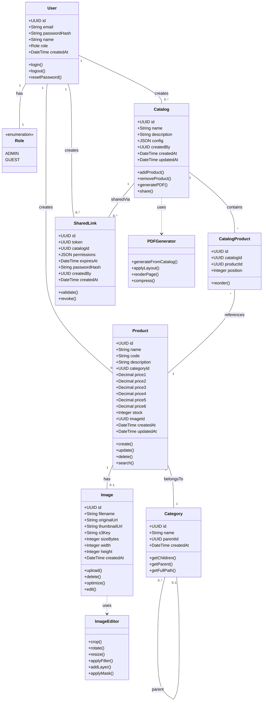

### Explicación de Relaciones

- **User ← Product/Catalog/SharedLink:** Un usuario Admin crea productos, catálogos y enlaces compartidos.
- **Product → Category:** Cada producto pertenece a una categoría.
- **Product → Image:** Cada producto puede tener una imagen asociada.
- **Category ↔ Category:** Relación auto-referencial para jerarquía (árbol de categorías).
- **Catalog ↔ Product (through CatalogProduct):** Relación muchos-a-muchos entre catálogos y productos.
- **Catalog → SharedLink:** Un catálogo puede tener múltiples enlaces compartidos.

---

## 3. Diagrama de Secuencia: Importar CSV

### Descripción
Flujo de importación de productos desde archivo CSV.

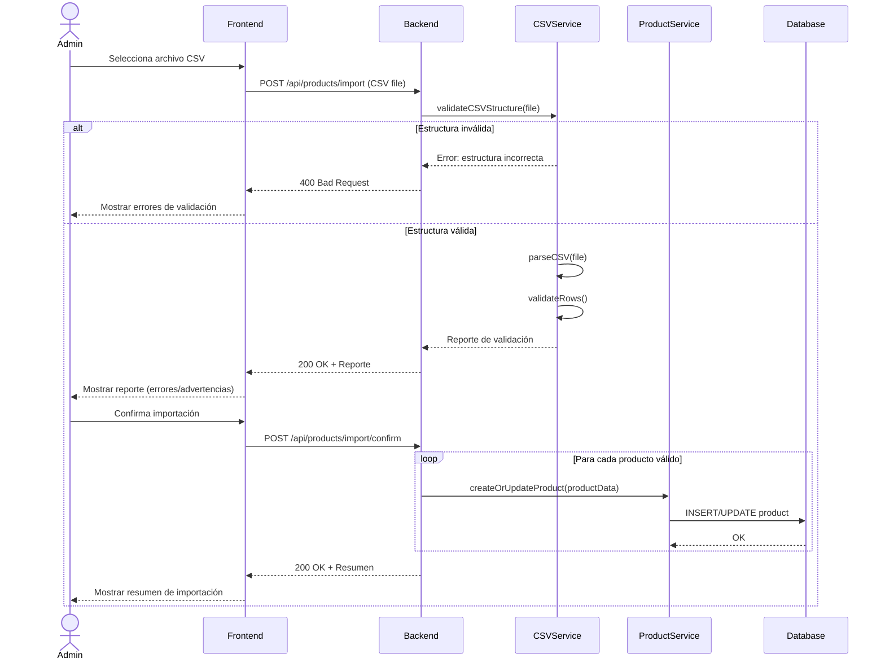

### Flujo Alternativo: Producto Duplicado


---

## 4. Diagrama de Secuencia: Generar Catálogo PDF

### Descripción
Proceso de generación de PDF desde catálogo diseñado.

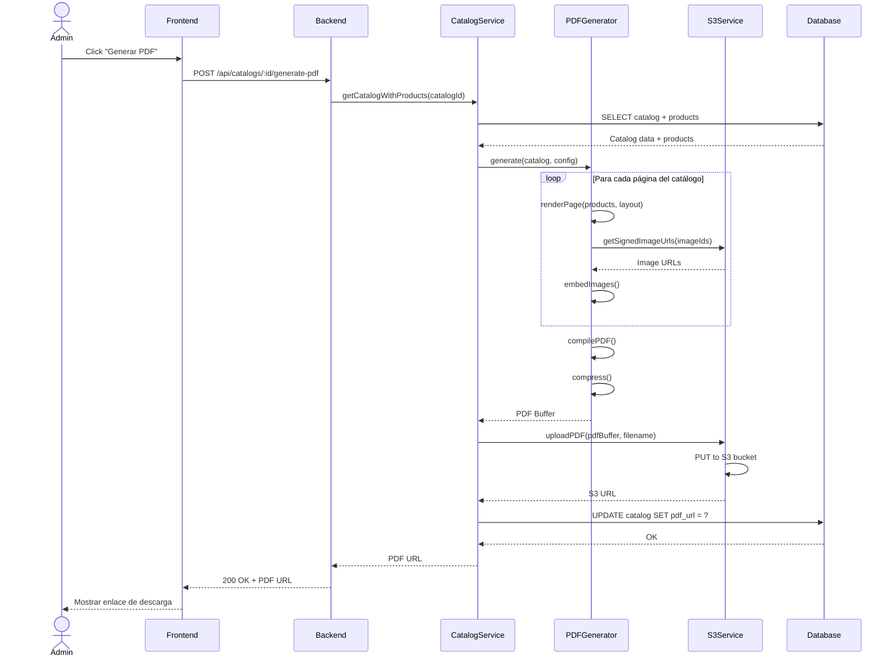

### Manejo de Error

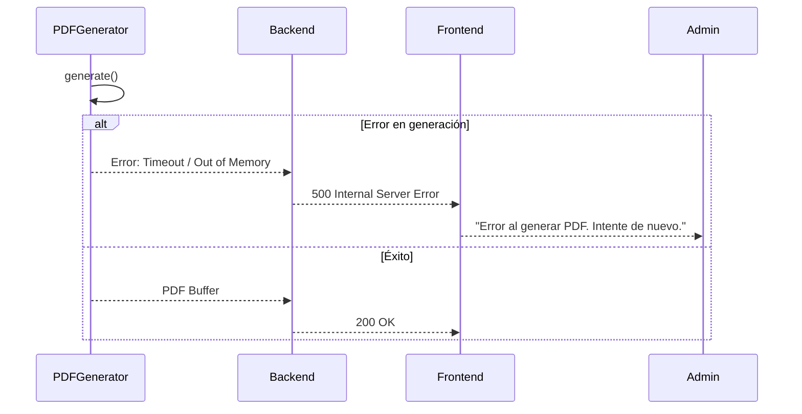

---

## 5. Diagrama de Secuencia: Acceso Guest

### Descripción
Flujo de acceso de un usuario Guest a catálogo compartido.

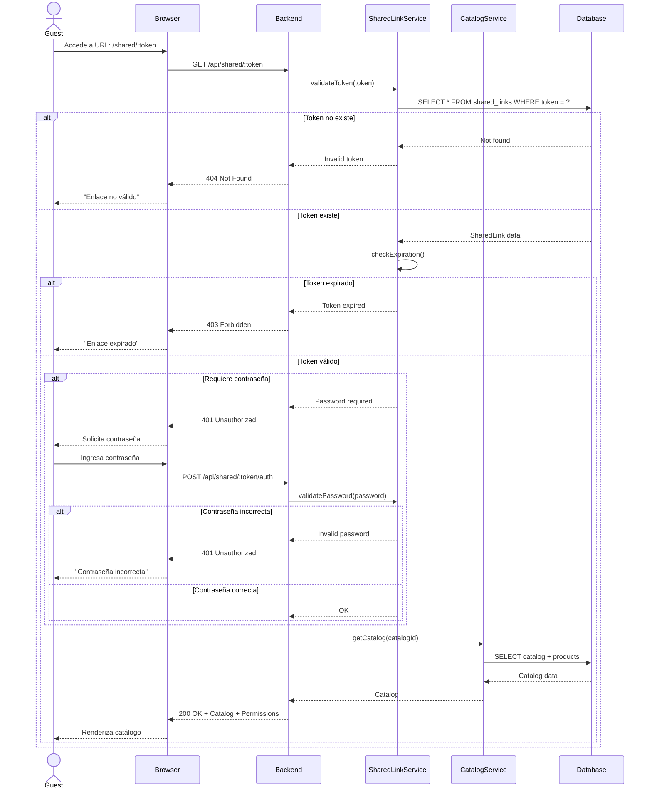

---

## 6. Diagrama de Componentes

### Descripción
Arquitectura de componentes del sistema, mostrando módulos principales y sus dependencias.

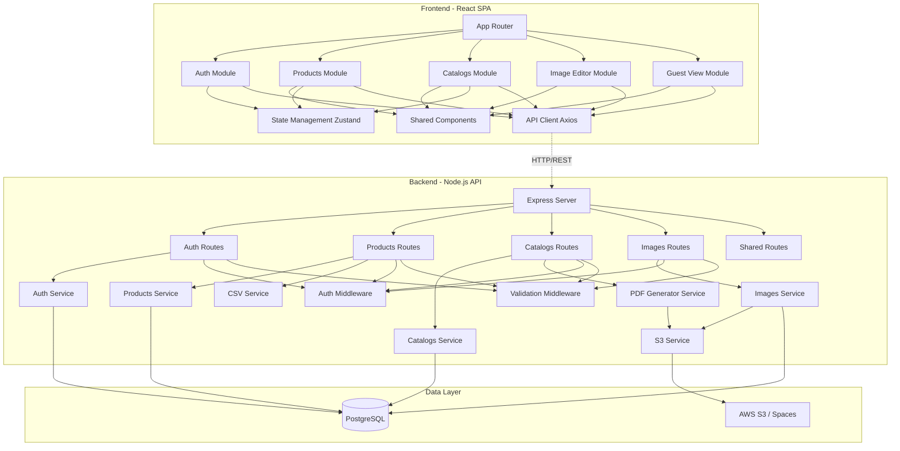

### Explicación de Componentes

#### Frontend
- **App Router:** Enrutamiento de la SPA (React Router)
- **Auth Module:** Login, registro, recuperación de contraseña
- **Products Module:** CRUD de productos, búsqueda, filtros, edición masiva
- **Catalogs Module:** Creación y diseño de catálogos
- **Image Editor Module:** Editor visual de imágenes
- **Guest View Module:** Vista simplificada para usuarios invitados
- **Shared Components:** Botones, inputs, cards, modales reutilizables
- **State Management:** Zustand para estado global de la app
- **API Client:** Axios configurado con interceptores y manejo de errores

#### Backend
- **Express Server:** Servidor HTTP principal
- **Routes:** Definición de endpoints REST
- **Services:** Lógica de negocio y comunicación con base de datos
- **Middlewares:** Autenticación JWT, validación de inputs, rate limiting

#### Data Layer
- **PostgreSQL:** Base de datos relacional para datos estructurados
- **S3/Spaces:** Almacenamiento de imágenes y PDFs generados

---

## 7. Diagrama de Despliegue

### Descripción
Infraestructura física y lógica donde se desplegará el sistema.

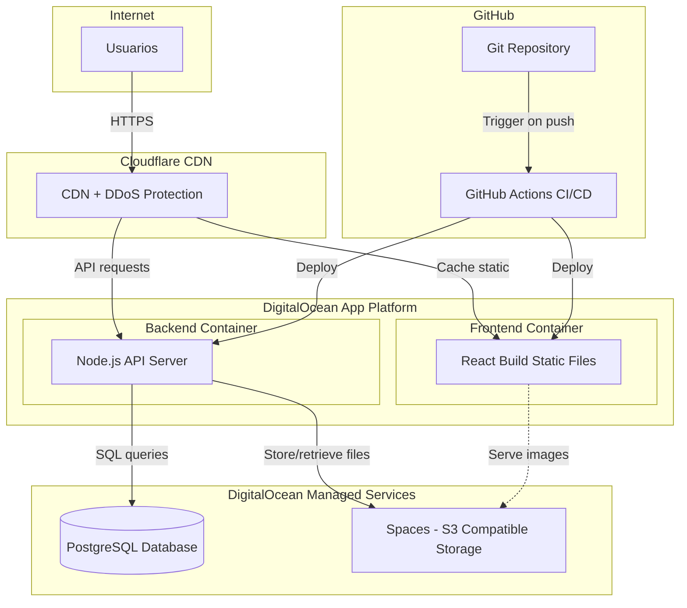

### Especificaciones Técnicas

#### Frontend (Static Hosting)
- **Plataforma:** DigitalOcean App Platform (Static Site)
- **Recursos:** CDN global incluido
- **Costo:** Gratis (incluido en plan)

#### Backend (Containerized App)
- **Plataforma:** DigitalOcean App Platform (Web Service)
- **Recursos:** 1GB RAM, 1 vCPU
- **Runtime:** Node.js 20 LTS
- **Costo:** $12/mes

#### Base de Datos
- **Servicio:** DigitalOcean Managed PostgreSQL
- **Recursos:** 1GB RAM, 10GB storage, 10 conexiones
- **Backups:** Automático diario incluido
- **Costo:** $15/mes

#### Almacenamiento
- **Servicio:** DigitalOcean Spaces (S3-compatible)
- **Recursos:** 50GB storage + CDN
- **Transferencia:** 1TB bandwidth incluido
- **Costo:** $5/mes

#### CI/CD
- **Plataforma:** GitHub Actions
- **Trigger:** Push a rama `main`
- **Acciones:** Lint → Test → Build → Deploy
- **Costo:** Gratis (plan estándar)

---

## 8. Diagrama de Actividades: Flujo Completo

### Descripción
Flujo end-to-end desde importación hasta descarga de catálogo por Guest.

```mermaid
flowchart TD
    Start([Inicio]) --> A[Admin inicia sesión]
    A --> B{Productos<br/>existen?}
    
    B -->|No| C[Importar CSV]
    B -->|Sí| D[Gestionar productos]
    
    C --> C1[Subir archivo CSV]
    C1 --> C2[Validar estructura]
    C2 --> C3{¿Válido?}
    
    C3 -->|No| C4[Mostrar errores]
    C4 --> C1
    C3 -->|Sí| C5[Importar productos]
    C5 --> D
    
    D --> D1[Buscar/filtrar productos]
    D1 --> D2{¿Editar<br/>imágenes?}
    
    D2 -->|Sí| E[Abrir editor de imágenes]
    D2 -->|No| F
    
    E --> E1[Aplicar efectos y capas]
    E1 --> E2[Guardar imagen editada]
    E2 --> F[Crear nuevo catálogo]
    
    F --> F1[Seleccionar productos]
    F1 --> F2[Elegir layout]
    F2 --> F3[Personalizar diseño]
    F3 --> F4[Vista previa]
    F4 --> F5{¿Diseño OK?}
    
    F5 -->|No| F3
    F5 -->|Sí| G[Generar PDF]
    
    G --> G1[Renderizar páginas]
    G1 --> G2[Compilar PDF]
    G2 --> G3[Almacenar en S3]
    G3 --> H[Generar enlace compartido]
    
    H --> H1[Configurar permisos]
    H1 --> H2[Copiar enlace]
    H2 --> I[Enviar enlace a cliente]
    
    I --> J[Cliente Guest accede]
    J --> J1{¿Enlace<br/>válido?}
    
    J1 -->|No| J2[Mostrar error]
    J1 -->|Sí| J3{¿Requiere<br/>contraseña?}
    
    J3 -->|Sí| J4[Ingresar contraseña]
    J4 --> J5{¿Correcta?}
    J5 -->|No| J4
    J5 -->|Sí| K
    J3 -->|No| K[Visualizar catálogo]
    
    K --> L{¿Tiene permiso<br/>descarga?}
    L -->|Sí| M[Descargar PDF]
    L -->|No| N[Solo visualizar]
    
    M --> End([Fin])
    N --> End
    J2 --> End
```

---

## 9. Diagrama Entidad-Relación (Base de Datos)

### Descripción
Modelo de datos detallado de la base de datos PostgreSQL.

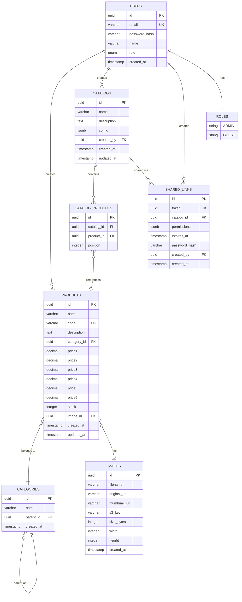

### Índices

```sql
-- Índices para búsqueda rápida
CREATE INDEX idx_products_code ON products(code);
CREATE INDEX idx_products_name ON products(name);
CREATE INDEX idx_products_category ON products(category_id);
CREATE INDEX idx_products_created_at ON products(created_at DESC);

-- Índices para categorías (árbol)
CREATE INDEX idx_categories_parent ON categories(parent_id);

-- Índices para catálogos
CREATE INDEX idx_catalogs_created_by ON catalogs(created_by);
CREATE INDEX idx_catalog_products_catalog ON catalog_products(catalog_id);
CREATE INDEX idx_catalog_products_product ON catalog_products(product_id);

-- Índices para shared links
CREATE INDEX idx_shared_links_token ON shared_links(token);
CREATE INDEX idx_shared_links_catalog ON shared_links(catalog_id);
CREATE INDEX idx_shared_links_expires ON shared_links(expires_at);

-- Índice para búsqueda full-text 
CREATE INDEX idx_products_search ON products USING GIN(to_tsvector('spanish', name || ' ' || description));
```

---

## 10. Diagrama de Estados: Catálogo

### Descripción
Ciclo de vida de un catálogo desde creación hasta compartido.

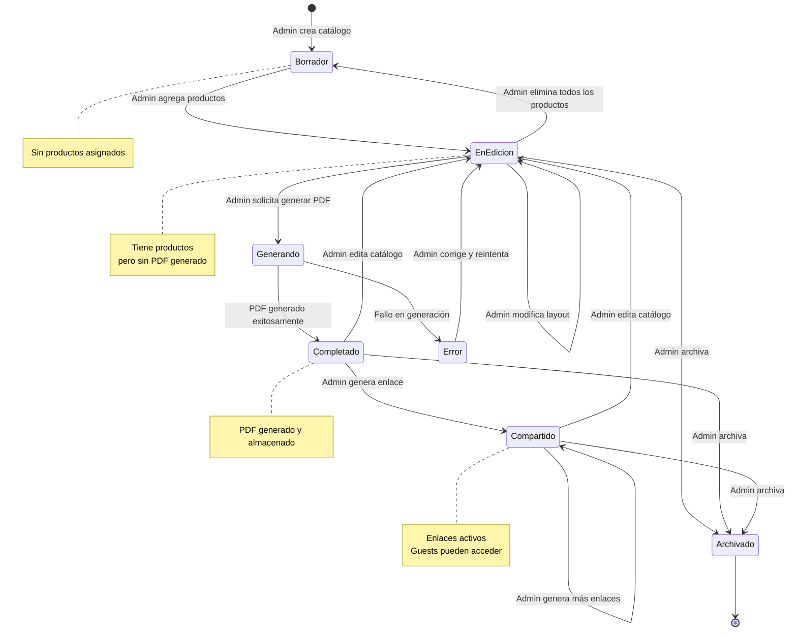

---

## 11. Diagrama de Paquetes: Estructura del Backend

### Descripción
Organización de módulos y paquetes del backend.

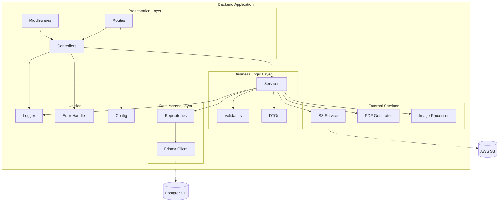

---

## Resumen de Diagramas

|  #  |     Diagrama     |           Propósito              |           Audiencia          |
|-----|------------------|----------------------------------|------------------------------|
|  1  | Casos de Uso     | Funcionalidades del sistema      | Stakeholders, Product Owner  |
|  2  | Clases           | Estructura de datos y relaciones | Desarrolladores              |
| 3-5 | Secuencia        | Flujos de interacción detallados | Desarrolladores, Testers     |
|  6  | Componentes      | Arquitectura de software         | Arquitecto, Desarrolladores  |
|  7  | Despliegue       | Infraestructura física           | DevOps, Infraestructura      |
|  8  | Actividades      | Flujo end-to-end                 | Todos                        |
|  9  | Entidad-Relación | Modelo de base de datos          | DBA, Desarrolladores Backend |
|  10 | Estados          | Ciclo de vida de entidades       | Desarrolladores, QA          |
|  11 | Paquetes         | Organización de código           | Desarrolladores              |

---

**Última actualización:** 12 de febrero de 2026  
**Versión:** 1.0
